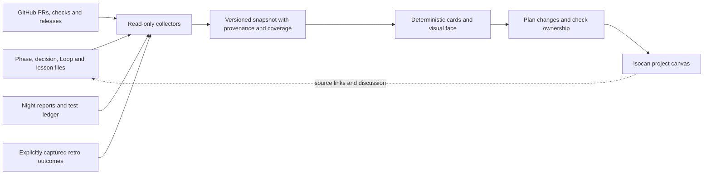

# A project's Keel life on an isocan canvas

**Design proposal, 8 October 2026. Not implemented.** Implementation is tracked
in [phase 50](../phases/50-project-life-on-isocan.md). This spec covers every
Keel-managed project, including projects with isocan's `docs/projects/*` shape;
it is not limited to the isocan software repository.

## What the owner gets

`keel canvas connect` creates or attaches one isocan canvas for a project.
A stable **Project pulse** card answers: what changed, what improved, what is
still waiting, and how trustworthy are these numbers? Beside it sit navigable
records for goals and delivery, Loop, lessons, retros, health and upkeep.
Every number opens its contributing records and each record opens its source.
A date filter, goal/subproject filter and source filter apply across the view.

The canvas is a projection of the practice, not a new project tracker. Moving
a card never moves a phase. A canvas comment never accepts a Loop finding.
GitHub owns merge state; phase records own acceptance and next work; accepted
decision records own architecture. Implemented, merged, production-verified
and lived-in remain independent facts with separate evidence and timestamps.

## The canvas at a glance

```text
Project: Acme                         Last successful sync / coverage / gaps
[7 days] [30 days] [all] [goal/subproject] [source] [open source records]
┌────────────────────────── Project pulse ──────────────────────────────┐
│ Fixed with evidence | accepted work | regressions | owner decisions   │
│ Trend + denominator + baseline + freshness; never one opaque score   │
└─────────────────────────────────────────────────────────────────────┘
 Goals & delivery      Loop → work          Lessons → shared practice
 phase/decision cards  triage + outcomes    local → home → release → fleet
 Health & upkeep       Retros → changes    Evidence & activity
 nights/CI/deps/drift  picked → proven      chronology + source coverage
```

Native canvas groups provide the six regions. Each holds one bounded index
card plus selected record cards, not thousands of nodes. Project pulse is a
Markdown source with a self-contained HTML visual face: charts and tables
share one embedded snapshot, accessible labels, keyboard filters, and textual
values. Color supplements labels. Trends distinguish missing intervals from
zeroes. Record details show provenance, disagreements and evidence strength.

A managed card may be moved, resized or commented on without the next sync
resetting it. Human notes live beside managed cards. A person editing managed
content creates a conflict to review, not permission to overwrite their work.
The initial placement happens once. A fleet overview, later, links project
canvases and compares only like-for-like measures with visible coverage.

## Source-grounded architecture



Keel stays dependency-free at runtime. An optional adapter invokes an explicitly
configured isocan executable using argument arrays, JSON output and bounded
process timeouts; never shell interpolation. isocan handles identity, its home,
and admission. Keel does not import isocan's TypeScript SDK or implement its
internal operation protocol. Absent isocan, snapshot and local render still work.

### Existing interfaces inspected

Source baseline: Keel `a7f56c3062e4d537e1e4a481c67eeaf4473d9cd4`;
isocan `b61f7c1b665b7903e12e81576cba8f0735ac3c7b` in the local checkout.
These are source observations, not proof of a deployed API or a live integration.

| Capability | Inspected implementation | Design consequence |
| --- | --- | --- |
| Canvas creation and JSON id | isocan `packages/cli/src/main.ts`, `canvas new <title>` (`create` alias); returns `canvasId`, optional space | explicit create operation; persist returned id, never infer it from title |
| Group placement | isocan `packages/api/src/canvas-groups.ts`; CLI `canvas group new` | native regions, preserve existing placement |
| Source + visual | isocan CLI `add file --visual file`, `edit item file --visual file`; `packages/cli/src/agent-guide.md`, items topic | one versioned pulse document with its visual face |
| Attributed item versions | isocan `packages/api/src/connect.ts`, `add` and `edit`; MCP `create_item`, `edit_item` in `packages/mcp/src/server.ts` | update stable item ids and verify resulting versions |
| Identity and home | isocan `packages/api/src/direct.ts`, CLI homes/sharing topics | use isocan authentication; do not store credentials in Keel config |
| Existing Keel readers | `lib/goals.mjs`, `lib/phases-projects.mjs`, `lib/improve.mjs`, `lib/lessons.mjs`, `lib/retro.mjs` | reuse structured readers; never scrape generated Markdown views |
| Loop local decisions | `practices/loop/README.md`, `practices/loop/files/scripts/loop.mjs` | read finding files; respect local variants and project-shaped references |
| Reconciliation | `docs/reconciliation.md`, night `record_contradictions` instrument | reuse its findings and GitHub facts; no second contradiction engine |

Capability discovery must verify JSON output, identity, create/read/edit/group
support and required flags against the installed isocan version. Pin the tested
version range in the adapter; fail clearly outside it. The baseline does **not**
establish conditional item writes, atomic multi-item publication or idempotent
creation. Those gaps constrain the rollout below.

## What flows into the canvas

| Lifecycle area | Authority / collection | What appears and links |
| --- | --- | --- |
| Init, adoption, updates | `.keel/keel.json`, lock, migrations, Git history and update PRs | adoption date when evidenced, CLI/practice versions, drift, update pending/merged/applied separately |
| Goals, planning, conduct | goals and phase adapters, dependencies, next action, evidence | outcomes, work in progress, blocked work, walks owed, accepted delivery, elapsed times only where history supplies timestamps |
| Architecture and reconciliation | accepted decisions plus existing reconciliation engine | supersession edges, contradictions, unknown GitHub facts, proposals awaiting review |
| Loop | configured findings, proposals, decisions, canonical source ids, linked phases/projects | incoming → proposed → accepted/declined/stale → done; our rank and upstream rank separate |
| Lessons and learning | configured lessons file, existing sent fingerprints, mothership inbox proposals/decisions, release and update evidence | local lesson → sent → considered → accepted → shipped → adopted; provenance across repos |
| Retros | explicit capture described below; `keel retro --json` counts when available | session friction, candidate choices and resulting guards, work still waiting, recurrence after a change |
| Improve and night shift | configured health directory, existing improve JSON and report metadata | measures, bounds, proposals, broken instruments, nights missing, last successful sample |
| Tests, CI, climb and tend | test ledger, CI run ids, climb/tend decision artifacts and PRs | flakes, slow tests, controlled before/after results, kept/reverted proposals, later verification |
| Dependency management | Renovate PR identity, CI and merge facts, lockfile at source revision | proposed/merged updates, failing checks, current version at measured commit; no inference of deployment |
| Reviews, drain, loose ends | review answers, queue PRs, `loose-ends` structured output | unanswered comments, pending decisions, queue backlog, parked work; exclude chat text |
| Release and fleet | release tags/notes, practice version and available fleet snapshots | changes shipped versus received, projects behind, coverage per checkout |

Local variants have named adapters and explicit unsupported reasons. An isocan
project-shaped phase is identified by project plus phase anchor, never just a
number. No collector silently installs a practice, runs a gate, mines Loop,
sends a lesson, invokes a model, merges a PR or runs a retro. Night publishing
consumes the report already measured that night, not another `improve` execution.

## Data contract and history

Proposed `snapshot.schema = 1` has `project`, `revision`, `generatedAt`,
`coverage`, `entities`, `relations`, `observations`, `metrics` and `warnings`.
`project.key` is a persisted UUID assigned at connection; canonical repository
identity and optional subproject are attributes, so renaming a repo does not
fork its history. A local-only project can connect before it has a remote.

Each entity has a stable key, kind, title, source references and owned fields.
Use phase path/project anchor, existing lesson fingerprint, canonical Loop
finding id/aliases, GitHub repository id + PR number, CI run id + attempt, or
retro record UUID. Never identify an entity solely by title or line number.
Relations carry their own provenance: `implements`, `addresses`, `supersedes`,
`derived-from`, `ships-in`, `adopted-by`. Unverified or heuristic matches are
suggestions and excluded from outcome counts until explicitly linked.

Each observation contains `id`, `entity`, `field`, `value`, `source`,
`sourceRevision`, `observedAt`, optional `occurredAt`, `quality` and `evidence`.
`quality` is verified, reported, inferred or unknown. Keep source timestamps
apart from first observation. Evidence describes what was checked, by whom,
against which revision and environment. A local phase status of built is a
reported implementation/acceptance claim, not a production verification.

Example (synthetic, abbreviated):

```json
{
  "entity": "phase:docs/phases/07-export.md",
  "facts": {
    "implemented": {"value": true, "source": "phase", "evidence": ["evidence/export.md"]},
    "merged": {"value": true, "source": "github:Acme/app#42", "observedAt": "2026-10-08T09:00:00Z"},
    "productionVerified": {"value": null, "reason": "no environment-scoped evidence"},
    "livedIn": {"value": false, "source": "phase"}
  }
}
```

Coverage per source reports `ok|stale|unavailable|unsupported|disabled`, sample
window, observed timestamp, expected cadence and reason. Disabled is not zero.
Dirty worktree snapshots are marked local/uncommitted and not published by
night CI. Missing Git history forbids invented retrospective transition dates.
Backfill only explicit historical facts; show the reliable observation start.

Persist generated snapshots outside authored phase/lesson files. Proposed
`.keel/canvas/` cache is ignored and rebuildable; CI uploads snapshots and sync
receipts as an artifact with 90-day retention. Remote immutable snapshot items
retain the same bounded history; weekly aggregates may be retained for one year
with explicit lower granularity. Retention gaps stay visible. The canvas is a
view and observation history, never the authoritative work record. A deletion
in sources becomes a tombstone, not erasure of previous observations.

## Measuring fixes and improvement honestly

Default window: last 30 UTC days, with prior 30 days alongside; allow seven days
or all recorded history. Every chart exposes numerator, denominator, sample
count, coverage and links. Distinct source ids deduplicate retried runs and
reimported findings; duplicate aliases remain visible for audit.

| Metric | Definition and limits |
| --- | --- |
| Fixes with evidence | distinct findings with explicit resolution and a linked passing proof for the affected revision; split reported done, proof-backed, production-verified, lived-in; declined/stale findings are not fixes |
| Accepted delivery | phases entering built/lived-in with their acceptance and evidence present in the window; source acceptance controls it, not PR merge; reopened phases shown separately |
| Loop completion | resolved accepted findings / accepted cohort at window start; new accepted work shown separately; time-to-fix only for paired known acceptance/resolution timestamps |
| Learning carried forward | distinct accepted lesson proposals shipped, then received by projects; adoption requires a project's observed version containing the guard, not merely an update PR merge |
| Retro follow-through | picked candidates with a linked implemented and proven change / picked candidates in the selected cohort; missing capture displayed as coverage, never zero candidates |
| Health trend | existing measure values and bounds by date; improvements use each measure's better direction; instrument errors break the line |
| Test/performance improvement | baseline and candidate from the same benchmark protocol/environment, samples and noise margin; keep/revert decision separate from later production observations |
| Regression/escape rate | explicit escapes and reopened outcomes / accepted deliveries in comparable windows; show raw counts and absent denominator as n/a |
| Operational use | observed active days, completed nights, conducted phases, captured retros and artifact-backed operations; label partial instrumentation; never equate CLI calls with value |
| Cost | recorded duration/model usage when available, with units and provider; unknown cost stays unknown; no estimate from commit counts |

No combined improvement score and no claim that Keel caused a change merely
because it followed adoption. Compare before/after only when definitions and
coverage match. A lesson linked to three fixes counts once as a lesson and three
times as findings, not four fixes. A later regression preserves the earlier
proof and adds a reopening event.

## Retros need one small new authored record

Current `keel retro` deliberately writes nothing and only counts supported
session transcripts. Leave that default intact. Propose an explicit
`keel retro capture --session <id> --since <sha> --record <file> --json` flow:
preview counts and redaction, then persist a user-reviewed record under the
configured `docs/retros/`. Unsupported providers can supply an explicitly
manual summary with `coverage: manual`; no fabricated transcript counts.

Schema: UUID, date, source revision/range, provider, optional local session
fingerprint, count coverage, seven-area summary, and at most five candidates.
Each candidate has id, type (check/skill/lesson), proposed action, decision
(pending/picked/declined), decision actor/date/reason, linked phase/PR/lesson,
and evidence references. Implementation/verification is derived from links;
owner decisions are authored in this record. Comments on the canvas link back
here and do not change the choice. Capture never selects a candidate itself.

Publish allowlisted counts and explicitly approved summary fields only. Exclude
raw transcripts, command text, transcript pointers, local absolute paths, tokens,
secrets and personal session identities. Local session pointers remain local.
Existing privacy rules on loose ends remain intact.

## Proposed CLI and configuration

These commands and fields are **new contracts**, not commands to run today.
All commands support `--json`; stdout is machine-readable, diagnostics stderr.

| Command | Contract |
| --- | --- |
| `keel canvas connect --create --title <title> --space <id>` | preview home/identity/access and creation plan; `--yes` performs it and stores stable binding |
| `keel canvas connect --canvas <address>` | validate explicit existing target and rights; preview managed region, attach only with `--yes` |
| `keel canvas snapshot --output <file>` | local collection, no remote canvas writes; `--github` explicitly refreshes GitHub facts |
| `keel canvas render --snapshot <file> --output <dir>` | deterministic Markdown, HTML and manifest; no external requests |
| `keel canvas sync [--dry-run]` | plan by default; `--yes` applies approved managed content changes with a receipt |
| `keel canvas status` | binding, last success, pending changes, conflicts and coverage; read-only |
| `keel canvas disconnect` | preview; `--yes` disables publishing, leaves remote canvas intact |

Exit 0 success/no changes; 1 conflicts, stale required sources or transport
failure; 2 invalid input/unsupported schema; 3 a write needs approval. JSON
includes `schema`, `operation`, `changes`, `coverage`, `warnings` and `exitCode`.
Partial collection may render locally, with `complete:false`; it must never
replace a known-good remote metric with zero. Exit 1 does not erase its output.

Proposed config: `canvas: {provider:"isocan", projectKey, home, canvasId,
spaceId, enabled, privacy:"summary", cadence:"nightly"}`. No secrets. Store
managed logical key → item id, content/version hashes and receipt ids in the
recoverable sync manifest, not in phase front matter. Config migration is
optional/additive: old projects continue unchanged. Snapshot schemas are
versioned separately; unknown major versions refuse publication.

The first connection requires the owner to choose the home/space and approve
which data is shared with that audience. Do not create a default public canvas
or overwrite `.isocan/project.json`/the existing working-canvas binding. Subsequent
writes use the explicit saved canvas address and a dedicated attributed identity.
No new model spend is required. A scheduled writer uses existing isocan-supported
credential storage and narrowly scoped access, provisioned by the owner.

## Synchronization, failure and ownership

1. Collect once at a named source revision; normalize; validate references,
   schema, privacy and existing reconciliation results. Derive content hashes
   excluding collection timestamps so unchanged content makes no new versions.
2. Read the target and recover the manifest. One writer per project, enforced
   with a CI concurrency group and local lock. Check stored ownership and last
   written versions. Refuse a changed managed content version; do not touch
   human cards or their placement/comments.
3. Plan create/update/retire with a stable operation id and write a durable
   pending receipt before sending anything. Preview exactly which summaries,
   audience and source links would be uploaded.
4. Publish immutable snapshot first, then versioned detail cards, and the pulse
   card last. The pulse references one complete snapshot id; partial detail
   failures leave it on the previous snapshot and show sync failure on status.
5. Read back content hashes and record acknowledged ids/versions. Retry reads;
   after an ambiguous write timeout, reconcile by operation metadata and hashes
   before any retry. Never blindly repeat canvas/item creation. If uniqueness
   cannot be established, stop with recovery instructions; never guess by title.

A local version check alone cannot prevent a simultaneous human edit. Before
in-place unattended editing ships, prove a conditional write primitive against
the installed isocan version. If absent, publish immutable run cards and leave
the curated pulse untouched; expose the latest successful run via the sync
receipt until isocan supports safe conditional advancement. This is an explicit
limited mode, not fulfillment of the complete live-pulse acceptance test.

Expired login, deleted canvas, revoked access, moved home, missing artifacts,
rate limits and offline GitHub retain the last success and expose a gap. Do not
auto-create a replacement canvas. A renamed repo preserves project identity;
a deliberate fork must choose a new identity. Untrusted finding/lesson text is
escaped as text, never executed as HTML or interpreted as an instruction.
The generated HTML loads no remote scripts, fonts or trackers and has no write
controls. Secret-bearing URLs are stripped, not embedded in evidence links.

## Delivery slices and acceptance proof

Each slice is independently reviewable under phase 50; proposed test filenames
below are implementation targets, not existing evidence.

1. **Local snapshot and visual:** reuse readers, define schema, coverage and
   metric reducers. `tests/canvas-snapshot.test.mjs` uses synthetic Acme data
   spanning every source row above, both phase shapes, duplicates, reopened
   findings, missing history and offline GitHub. Golden metric inputs assert
   denominators and stage separation. `tests/canvas-render.test.mjs` verifies
   source links, escaping, unknown states, deterministic output and no network.
2. **Connected canvas:** optional isocan adapter, connect/plan/sync/status,
   stable ids, owner preservation and crash recovery. Fake transport tests
   cover duplicate retries and ambiguous responses; a real disposable private
   canvas verifies create, groups, dual-face versions, read-back, admission and
   supported concurrency semantics. Fixtures alone do not prove isocan works.
3. **Retro and lifecycle coverage:** explicit reviewed capture, decision links,
   lesson shipping/adoption chain and recorded usage observations. Test redaction,
   unsupported provider/manual input, changing decisions, and evidence revocation.
   No unattended retro execution or invented historical usage.
4. **Existing night integration:** opt-in sync after existing measurements,
   reusable snapshot artifact, credentials separated from untrusted PR jobs,
   one writer and no additional model invocation. Exercise the actual workflow
   shell through success, offline source, auth expiry and interrupted publication.
5. **Walk on a real adopted project:** owner opens the resulting canvas, filters
   7/30 days and a goal, follows Loop finding → phase → proof → merge and lesson
   → shipped guard → observed adoption, plus retro choice → proven change.
   Show a known merged-but-unaccepted item, a missing sample and a reopened fix.
   Re-run unchanged: no duplicate canvas/cards or content versions. Move a card
   and add a note: both survive. Concurrent edit must conflict without loss.
   Observe at least seven scheduled nights before claiming lived-in operation.

Final implementation gate is `npm run check`, including the new focused tests;
managed templates and CLI help must ship with the integration. This spec's
completion does not claim that any of these implementation tests exist or pass.

## Decisions and open boundaries

Settled in this design: one explicit project canvas; native groups plus a
source/visual pulse; read-only projection; optional CLI adapter; source-owned
acceptance; evidence-backed metrics; local-first preview; existing night and
reconciliation engines; explicit retro capture rather than mining private chats.

Still to prove during slice 2: deployed isocan version/capabilities, conditional
write support, recoverable operation identity, and credential scope for the
selected home. These determine unattended in-place sync, not the data model.
During the owner walk, choose the home/space/audience and test retention against
its quotas. If immutable history is too large, lower retention explicitly and
show its coverage limits; do not silently discard samples. Fleet-wide views
follow per-project proof and never aggregate private records into a wider space.
